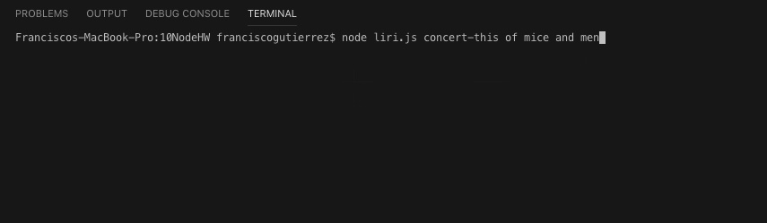

# liri-node-app

This app is a node.js terminal app. You can search for upcoming concerts, look up songs, and look up some facts about movies. This is a good project to work on to help me figure out how to get the basics of Node.js down. Also a cool app to look up songs, concerts, and movies up really fast.

### How to use the App
To use this app you have to navigate to the file in your terminal. Then your commands will always start with the same thing in the first two. They are *node liri.js*. After this you have a choice of four commands for the next slot. 

1. concert-this
2. spotify-this-song
3. movie-this
4. do-what-this-says

##### concert-this

1. node liri.js concert-this "your-artist-choice"
    For this command you will get in return 
    1. Name of Venue
    2. Venue Location
    3. Date of the Event (MM/DD/YYYY Format)

##### spotify-this-song

2. node liri.js spotify-this-song "your-song-choice"
    For this command you will get in return 
    1. Artist Name
    2. The song's name
    3. A URL for a preview of the song
    4. The album the song is from

##### movie-this

3. node liri.js movie-this "your-movie-choice
    For this command you will get in return 
    1. Title of movie
    2. Year movie was released
    3. IMDB Rating
    4. Rotten Tomatoes Rating
    5. Country of production
    6. Language of the movie
    7. Plot (a short version)
    8. Cast

##### do-what-this-says

4. node liri.js do-what-it-says
    This command will read another text file and depending on what is in that file it will perform one of the previouse three commands for the movie, song, or artist in the file.

##### logging your results

There is also a txt file that saves the name and results of all your searches. That is log.txt. 

